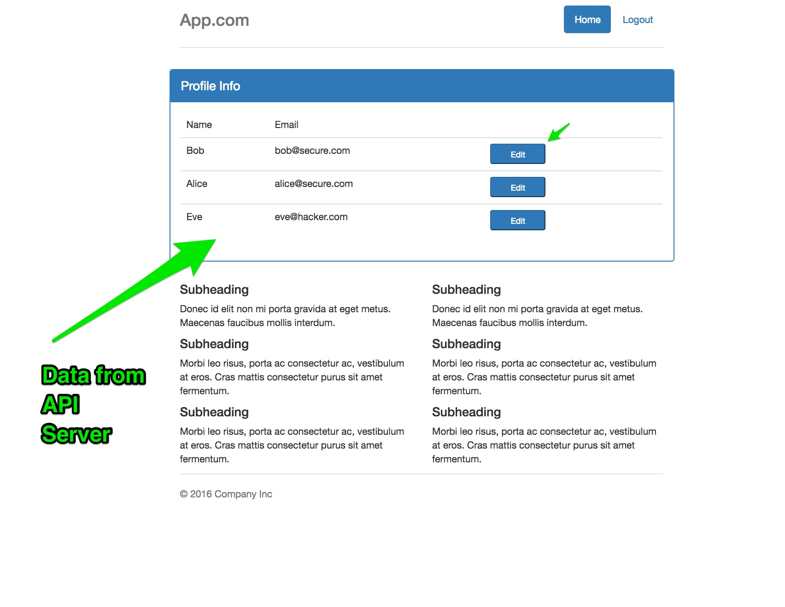
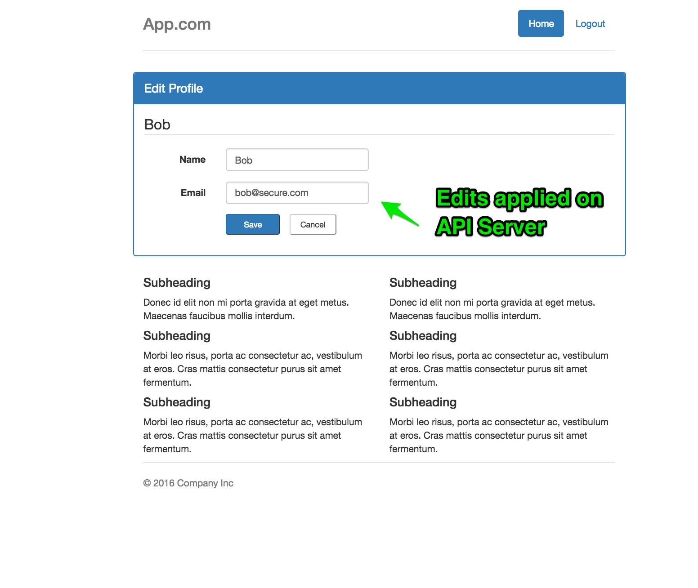

## Auth0 (AngularJS) Single Page Application + API Server Sample

This is a companion `client` sample for the [Auth0 Spring Security API Sample](https://github.com/auth0-samples/auth0-spring-security-api-sample).

Please refer to that sample and documentation to get your API Server up and running. There is no specific dependency on that implementation from a technology perspective, but this sample has been coded as a Client for RESTful service endpoints provided by that API Server sample.

The purpose of this sample is to provide an easy to understand seed project for users wishing to combine Java Spring Security API Server with a single page application front-end.

The sample can run in two different `modes` and how to configure for the `mode` you want is discussed in the next section.

1). The SPA and API Server trust one another, and share the same Auth0 `application` information. In other words, they both have the same ClientId and therefore share the same Audience in their JWT Tokens. Hence the JWT Token received upon successful authentication in the SPA application is also passed in the Authorization Bearer header of the AJAX requests to the API Server. The API Server accepts the audience as it is the same as its own.

2). The SPA application and API Server each have their own Auth0 Application on a shared Tenant (Account / Domain). In this situation, each has a
different ClientId, and the Audience of the JWT Token generated for each application is different. The SPA application logs in and receives a JWT
Token for authentication / authorization checks local to the SPA application. When making AJAX requests to the API Server, a delegation token is
used instead - in effect, the SPA application swaps its own JWT Token for a JWT Token that is valid for requests to the API Server.

### Configuring the sample

For either `mode`:

Update `auth0-variables` providing your `AUTH0_DOMAIN`, `AUTH0_CLIENT_ID` and `API_SERVER_URL` - here the domain and clientId
correspond to the Auth0 Application of the SPA (angular) itself.

Example below:

```
var AUTH0_DOMAIN='arcseldon.auth0.com';
var AUTH0_CLIENT_ID='eTxxxxypLq2LcxxxxhYL6xxxxMDh';
var API_SERVER_URL='http://localhost:3001';
```

Now, the values of the next two settings depend on whether you wish to use delegation. If you do want to use
delegation then the assumption is that you have already defined two different Auth0 applications in the Dashboard,
one that is configured and running API Server, and one that is configured as above for the SPA app.

```
var DELEGATION_ENABLED=true;  // should be false if NOT using delegation
var API_SERVER_CLIENT_ID='DJExxxxxxxvvZEARj4xxxxxxxx1Uxh'; // should be '' if NOT using delegation
```

That's it. For delegation, the `delegationToken` itself is cached locally in storage to avoid `rate-limit` issues.

### Running the example

In order to run the example you need to just start a server. What we suggest is doing the following:

1. Install node
1. run `npm install -g serve`
1. run `serve` in the directory of this project.

Go to [http://localhost:3000](http://localhost:3000)

### Screen Shots

##### Login using Lock


##### Home Page - Profile Administration



##### Update Profile




### Background Information

For the sake of simplicity, build tools and steps (minification etc), and dependency management with tools such as `bower` have been avoided. This sample instead focuses on successful authentication with Auth0, and subsequent secured API calls to an external API Server hosted on a different web server.

